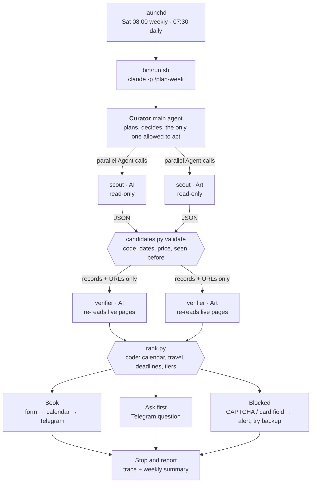

# Curator

**An agent that books free AI talks and art events for me every week.**

Every Saturday, Curator reads my calendar, searches 27 Boston and Cambridge event sources, picks the single best free AI event and the single best free art event for a week a month ahead, registers for them, puts them on my Google Calendar, and tells me on Telegram. Every morning it reads my Telegram replies (ratings, answers, rule changes) and re-checks upcoming bookings for new conflicts.

It is built as a [Claude Code](https://code.claude.com/docs) agent. Almost all of the behavior is configuration: an instructions file, two subagents, five skills, hooks and permissions. The only code is a set of small Python command-line tools and a mock event website for testing. It runs for real on my Mac, on a schedule.

```
Booked (AI): HCI Seminar with J.D. Zamfirescu-Pereira, "Understanding and Overcoming
Alignment Challenges in Designing with Generative AI".
Tue Oct 6, 4:00-5:00pm, MIT CSAIL 32-D463 (4 min walk).
Why it won: tier-2 speaker (UCLA assistant professor, Google PhD Fellowship). Free, no
registration needed. It is on your calendar.
```
<sub>A real Telegram message from a live run. More in [docs/evidence/phase10-pilot/](docs/evidence/phase10-pilot/).</sub>

---

## Contents

- [What it does](#what-it-does)
- [How it works](#how-it-works)
- [Guardrails](#guardrails)
- [Does it work? Evaluation](#does-it-work-evaluation)
- [Try it without any accounts](#try-it-without-any-accounts)
- [Set it up for yourself](#set-it-up-for-yourself)
- [Running and scheduling](#running-and-scheduling)
- [Talking to it on Telegram](#talking-to-it-on-telegram)
- [Configuration reference](#configuration-reference)
- [Repository layout](#repository-layout)
- [Cost](#cost)
- [Known limitations](#known-limitations)
- [Further reading](#further-reading)

---

## What it does

**The weekly plan (Saturday 08:00).** Curator plans the Monday-to-Sunday week that starts at least four weeks out, and re-checks the weeks in between. For each week and category (one AI event and one art event by default) it:

1. Works out where I am each day from the calendar: all-day city entries, flights, hotels. A week in New York means no Boston bookings, and any travel day is off limits.
2. Skips the category if my calendar already has a one-off event of that kind. Classes and recurring meetings don't count.
3. Sends two scouts out in parallel to search the event sources, then has two verifiers re-check every candidate against its live page.
4. Keeps only events that are free, in person, in the city I'm in that day, and at least 15 minutes clear of my calendar on each side after travel time. Nothing the evening before a homework deadline, and nothing I've already been to.
5. Picks the event with the most notable speaker or artist, then breaks ties by venue, format, what I've rated highly before, and travel time.
6. Registers (filling the form only from my profile), adds it to Google Calendar and sends a "Booked" message. If anything is uncertain, it asks me on Telegram instead.

**The daily check (07:30).** Curator reads my Telegram replies and acts on them: it books a pick when I answer "1", records ratings, applies rule changes and answers `/status`. It also retries registrations that weren't open yet, asks me to rate events I went to, and cancels or flags bookings that a new calendar entry now conflicts with.

**What it will never do.** Pay for anything, type a password or card number, create an account, or get past a CAPTCHA. It never invents an answer to a form question, and it never books something mediocre just to fill the week. Those rules are enforced in code, not only in the prompt (see [Guardrails](#guardrails)).

---

## How it works



**One main agent and two kinds of helpers.** The main agent (Claude Opus, instructions in [`CLAUDE.md`](CLAUDE.md)) owns the plan, the rules, memory and every action with a side effect. It delegates two jobs:

| Subagent | Job | What it gets | Limits |
|---|---|---|---|
| [`scout`](.claude/agents/scout.md) | Find up to 6 candidate events for one category, one city, one week | The source list, the date window, and events to skip from memory | Sonnet, 30 turns, no writing, no browser, shell limited to `tools/fetch.py` |
| [`verifier`](.claude/agents/verifier.md) | Re-check each candidate against its live page: date, price, registration state, venue, speaker evidence | The event records and URLs only, never the scout's notes | Sonnet, 20 turns, same restrictions |

**Code between the agents.** The main agent never takes a subagent's word for anything. Scout output is saved and checked by [`tools/candidates.py`](tools/candidates.py): valid JSON, dates inside the week, not paid, not seen before. Only then does it go to a verifier. Candidates that fail are written to memory with the reason, so they aren't evaluated again. Filtering and ranking happen in [`tools/rank.py`](tools/rank.py), deterministically. A category whose scout comes back empty gets at most two retries, then it's skipped and the summary says why.

**Autonomy tiers.** Before touching a registration form, [`tools/rsvp.py`](tools/rsvp.py) classifies it:

- **Tier 1:** every required field is in my profile. Curator fills it and submits.
- **Tier 2:** a field it can't answer, an unclear price, an out-of-town event, or an Eventbrite registration. Curator asks me on Telegram and waits.
- **Tier 3:** a password, card, ID or CAPTCHA. Curator doesn't touch the form: it takes a screenshot, alerts me, and moves on to the backup pick.

**Memory.** Curator keeps these files between runs:

- `memory/history.jsonl`: everything booked, attended, skipped or cancelled, so it never books the same exhibition or the same talk twice.
- `memory/seen.jsonl`: rejected candidates, with the reason.
- `memory/taste.md`: regenerated from my 1–5 ratings, used only to break ties.
- `state/bookings.json` and `state/pending.json`: bookings and open questions.

All of these are written only through the tools, never directly by the model.

**An observable loop.** Every run writes a trace to `logs/runs/<run id>.md` with the sections Goal, Plan, Loop (decide → act → observe → evaluate), Decisions, Escalations and Stop reason. A hook adds every tool call to it, so the actions are complete even when the model doesn't narrate them. Every run ends with one of these stop reasons: `all_slots_resolved`, `candidates_exhausted`, `budget_hit`, `tier3_blocker`, `error` or `nothing_due`. An example is [a live trace](docs/evidence/phase10-pilot/demo-live-trace.md).

---

## Guardrails

The rules that must never bend are enforced outside the model:

| Guardrail | Where it is enforced |
|---|---|
| Three modes: `live` (real bookings), `dry` (real reads, no writes, Telegram tagged `[DRY RUN]`) and `fixture` (mock site only). Unset means `dry`. | `require_write()` in [`tools/_common.py`](tools/_common.py) runs before every calendar write, form submission or message; dry mode also denies browser clicks and typing in [`config/modes/dry.json`](config/modes/dry.json) |
| No typing into password, card, CVV, SSN or passport fields, in any mode | [`tools/hooks/guard.py`](tools/hooks/guard.py) (PreToolUse hook) |
| Subagents can only fetch pages | frontmatter tool lists in `.claude/agents/` plus the guard hook |
| Tool-call budget per run (220 weekly, 80 daily) | guard hook, plus `--max-turns` and `--max-budget-usd` in [`bin/run.sh`](bin/run.sh) |
| Free events only | price labels in [`config/rules.yaml`](config/rules.yaml), filtered in `rank.py`; `tools/rules.py` refuses to change these keys, even from a Telegram command |
| No secrets in the repo, logs or messages | `.env`, the OAuth token and the profile are gitignored and denied to the agent in [`.claude/settings.json`](.claude/settings.json); tool output is redacted |
| Web pages are data, not instructions | stated in `CLAUDE.md` and tested: a fixture page contains a prompt-injection paragraph, and every run ignores it and reports it |
| Marketing opt-ins stay unchecked | the form classifier marks them `leave_unchecked` |

---

## Does it work? Evaluation

The evaluation compares Curator against a **baseline**: one Claude Code session with the same model, the same tools, the same mock site and browser, and the same rules written as a plain-language prompt. The baseline has no `CLAUDE.md`, subagents, skills, memory, trace or budget hook; a hook confirms no instruction files were loaded in any baseline run. Each configuration ran every case three times. [`eval/check.py`](eval/check.py) scores the runs from the mock site's own records (what was actually submitted), never from what the agent claims.

| Case | Baseline | Curator |
|---|---|---|
| 1. Normal week; memory holds an exhibition I already attended | 0/3 (re-booked it every time) | 3/3 |
| 2. An AI talk is already on the calendar | 3/3 | 3/3 |
| 3. The only "AI" on the calendar is a class | 3/3 | 3/3 |
| 4. Boston Mon–Wed, New York Thu–Sun | 3/3 | 3/3 |
| 5. The top pick is sold out, and a listing is stale | 3/3 | 3/3 |

| Mean per run | Baseline | Curator |
|---|---|---|
| Rule violations | 0.2 | 0 |
| Unnecessary questions to me | 1.73 | 0 |
| Tool calls | 32 | 99 |
| Wall time | 153 s | 374 s |

Six extra failure probes also pass: a "free" form that asks for a card, a required free-text question, an unclear registration page, registration not open yet, Telegram failing on the first send, and the calendar API failing on the first write. Details: [`eval/results.md`](eval/results.md), [`docs/failure_tests.md`](docs/failure_tests.md), and the design record in [`docs/ADR-001-agent-architecture.md`](docs/ADR-001-agent-architecture.md).

The honest summary: on a small, clean mock site a strong model with a good prompt gets most things right. The harness makes the difference on memory, on asking only the questions that need asking, and on leaving evidence behind. It costs about three times as many tool calls.

---

## Try it without any accounts

Fixture mode needs no Google, Telegram or event-site accounts. It runs against a mock event website on localhost with fake people and fake events.

**Requirements:** macOS (Linux is untested), Python 3.13, Node 18+ (for the Playwright browser server), Google Chrome, and [Claude Code](https://code.claude.com/docs) signed in (a Claude subscription or an API key).

```bash
git clone <this repo> curator && cd curator
python3.13 -m venv .venv && ./.venv/bin/pip install -r requirements.txt

# 1. Check the test fixtures and tools (no model calls, a few seconds)
python3 eval/check.py selftest
for t in events clock travel rsvp memory taste bookings pending rules candidates rank trace; do
  python3 tools/$t.py selftest
done

# 2. Browse the mock event site
python3 fixtures/site/server.py --case case1_normal_with_memory --port 8765 --out /tmp/submissions.jsonl
#    then open http://127.0.0.1:8765/

# 3. Watch one full agent run on the failure case (about 6 minutes, visible browser)
bin/demo.sh
#    trace: demo/logs/runs/demo.md

# 4. Or run the scored evaluation for one case
python3 eval/run_eval.py run --config improved --case case5_failure_recovery --runs 1 --force
python3 eval/run_eval.py report
```

Use `python3.13` explicitly when you create the venv. If a newer Python is also installed, a plain `python3 -m venv` can end up with a mismatched interpreter. The tools re-launch themselves inside `.venv`, so `python3 tools/<name>.py` works from any shell.

---

## Set it up for yourself

Curator is written for one person in Boston, but everything specific to me is in config files.

1. **Profile.** `cp config/profile.example.yaml config/profile.yaml` and fill it in (name, email, affiliation, home address). Registration forms are filled only from this file. The file is gitignored.
2. **Rules and sources.** Edit [`config/rules.yaml`](config/rules.yaml) (home city and area, categories, filters, budgets) and [`config/sources.yaml`](config/sources.yaml) (event sources per city; [`docs/sources.md`](docs/sources.md) explains how the Boston list was chosen).
3. **Secrets.** `cp .env.example .env`, then fill it in as you go through the next two steps. Never paste these values into a chat with an agent.
4. **Google Calendar.** Follow [`docs/SETUP_GOOGLE.md`](docs/SETUP_GOOGLE.md) (a desktop OAuth client, about 10 minutes), then run `CURATOR_MODE=dry python3 tools/gcal.py auth`. Curator reads every calendar you have selected and writes its bookings to your primary calendar, tagged so it only ever edits its own events.
5. **Telegram.** Follow [`docs/SETUP_TELEGRAM.md`](docs/SETUP_TELEGRAM.md): create a new bot with @BotFather and put the bot token and your chat id in `.env`.
6. **Browser sign-in (optional).** `bin/browser-login.sh` opens Chrome on Curator's own browser profile. Sign in to Luma if you want Curator to manage those registrations, then quit Chrome. Curator reuses the session and never sees a password.
7. **Claude Code.** Sign in once (`claude`). Scheduled runs use that login; nothing in the repo holds a Claude credential. The first headless run in a new folder may need the folder marked as trusted: run `claude` interactively in the project once and accept.

Then preview a week without writing anything:

```bash
bin/run.sh weekly --mode dry 2026-10-26
```

Read the trace in `dryrun/logs/runs/`. The Telegram messages arrive prefixed `[DRY RUN]`.

---

## Running and scheduling

```bash
bin/run.sh weekly --mode dry               # plan the whole horizon, no writes
bin/run.sh weekly --mode dry 2026-10-26    # one week only
bin/run.sh weekly                          # live
bin/run.sh daily                           # live daily check
```

| Output | Where |
|---|---|
| Run trace | `logs/runs/<run id>.md` (dry runs: `dryrun/logs/runs/`) |
| Every tool call | `logs/tool_calls.jsonl` |
| Every side effect, including blocked ones | `logs/writes.jsonl` |
| Claude Code's result and errors | `~/Library/Logs/curator/<run id>.json` and `.err` |

**Schedules (macOS launchd):**

```bash
bin/schedule.sh install        # weekly Saturday 08:00, daily 07:30, both live
bin/schedule.sh status         # loaded? last exit code? log paths
bin/schedule.sh run-now daily
bin/schedule.sh remove
```

If the Mac is asleep at the scheduled time, launchd runs the job when it wakes. If it was shut down, the next daily check notices the weekly plan is more than 7 days old and runs it first. No Chrome window may be using Curator's browser profile when a run starts.

---

## Talking to it on Telegram

Curator has no server running all the time. It reads your replies at the start of the next run (every morning), so answers take effect the next day.

| You send | Curator does |
|---|---|
| `1`, `2`, `3` in reply to a question | Books, skips, or books the backup |
| `4, great speaker` or `didn't go` | Records attendance and rating; ratings reorder future ties |
| `no more crypto talks` | Adds an exclusion to `rules.yaml` and logs the diff in `memory/rules_history.jsonl` |
| `art every other week` | Changes the category schedule |
| `/rules` | Shows the current rules |
| `/status` | Shows upcoming bookings and open questions |

Changes that would break a guardrail, such as allowing paid events, are refused.

---

## Configuration reference

| File | What it controls |
|---|---|
| [`CLAUDE.md`](CLAUDE.md) | The main agent's instructions: guardrails, team protocol, booking and cancellation procedures, message formats, stopping and escalation conditions |
| [`config/rules.yaml`](config/rules.yaml) | Categories (data, not code), filters, ranking order, registration platforms, budgets. The single source of truth for what gets booked |
| [`config/sources.yaml`](config/sources.yaml) | Event sources per city, with priorities and reasons, plus a search fallback for other cities |
| `config/profile.yaml` | Your details for registration forms (gitignored) |
| [`.claude/agents/`](.claude/agents/) | Scout and verifier definitions: tools, model, turn limits |
| [`.claude/skills/`](.claude/skills/) | `/plan-week`, `/daily-check`, `/rules`, `/status`, `/eval` (`verify` is a developer checklist) |
| [`.claude/settings.json`](.claude/settings.json) | Permissions and the four hooks |
| [`config/modes/`](config/modes/) | Per-mode Claude Code settings passed with `--settings` |
| [`.mcp.json`](.mcp.json) | The browser (Playwright MCP 0.0.82) on Curator's persistent Chrome profile |
| `.env` | Telegram token and chat id, calendar id, optional Google Maps key (gitignored) |

**Tools.** Each tool is `python3 tools/<name>.py <verb> [--flags]`, prints one JSON object, and supports `--help`:

| Tool | Verbs |
|---|---|
| `clock.py` | `context`: mode, today, which weeks to plan |
| `week.py` | `brief`: calendar, blocked evenings, slot status, exclusions, sources and busy times for the scouts, in one call |
| `gcal.py` | `list`, `free-check`, `create`, `delete`, `auth` |
| `deadlines.py` | `list`, `blocked-evenings`: from calendar entries named "due" or "deadline", plus an optional Canvas ledger |
| `travel.py` | `estimate`: geocoding plus a distance-based transit estimate |
| `fetch.py` | `<url>`: a page as text, links and forms; `--listing --window` keeps only what mentions the week, `--event` drops menus and adds the date, price and registration lines |
| `rsvp.py` | `classify-form`: autonomy tier and fill plan, from a URL or a browser snapshot |
| `telegram.py` | `send`, `get_updates`, `ack`, `whoami` |
| `candidates.py` | `intake` (validate + prepare for the verifier), `finish` (apply verdicts + rank); the single steps `save`, `validate`, `for-verifier`, `apply-verdicts` |
| `rank.py` | `rank`: hard filters, then pick and backup |
| `bookings.py` | `plan`, `book`, `skip`, `promote-backup`, `cancel`, `set`, `mark`, `upcoming`, `due` |
| `pending.py` | `add`, `list`, `answer`, `close`, `mark` |
| `memory.py` | `record`, `status`, `rate`, `seen`, `exclusions`, `history` |
| `taste.py` | `score`, `regenerate` |
| `rules.py` | `show`, `set`, `exclude`, `add-category`, `remove-category` |
| `trace.py` | `start`, `append`, `stop`, `render` |
| `runs.py` | `record`, `stale` |

---

## Repository layout

```
CLAUDE.md               main agent instructions
.claude/agents/         scout and verifier subagents
.claude/skills/         /plan-week, /daily-check, /rules, /status, /eval
.claude/settings.json   permissions and hooks
config/                 rules.yaml, sources.yaml, modes/, profile.example.yaml
tools/                  the Python tools; tools/hooks/ holds the four hooks
bin/                    run.sh, schedule.sh, browser-login.sh, demo scripts
launchd/                weekly and daily LaunchAgent templates
fixtures/               mock event site (site/server.py) and 11 test cases (build_cases.py)
eval/                   baseline vs Curator harness, checker, results, recorded runs
docs/                   report, ADR, setup guides, sources, failure tests, evidence
memory/, state/, logs/  runtime data (gitignored)
```

`DECISIONS.md` records every default that was chosen and why, phase by phase.

---

## Cost

These are Claude Code's own estimates at API list prices. With a Claude subscription, runs count against your usage limits instead.

| Run | Time | Estimated cost |
|---|---|---|
| One week on all real sources | about 8 min | about $4 |
| Daily check | 1–2 min | under $1 |
| One evaluation run (fixture) | about 4 min | about $2 |

A performance pass cut one week from 42 minutes and $8.62 to 8 minutes and $4.19 with the same picks: pages are trimmed to the parts that matter, a hook saves the helpers' answers so the main agent never re-types them, the week's context arrives in one call, and small label disagreements are corrected instead of re-searched. Details and measurements are in [`DECISIONS.md`](DECISIONS.md). To make it cheaper still, use Sonnet for the main agent (`CURATOR_MODEL` in `.env`), at some risk to judgment.

---

## Known limitations

- **Eventbrite can't be automated.** Its checkout shows a CAPTCHA, so Eventbrite events arrive as a link for you to register yourself.
- **Luma cancellations need a signed-in browser profile.** Without one, Curator tells you to use the link in Luma's confirmation email.
- **Luma's city page only lists the next few days**, so it contributes little to a plan made four weeks ahead.
- **"Free" is sometimes unknowable.** Many university pages state no price. Curator asks rather than guesses, and different runs can judge the same page differently.
- **Out-of-town search is weak.** Some museum sites block plain page fetches.
- **Scheduling is macOS only** (launchd). Everything else runs anywhere Claude Code and Chrome run.
- **One user.** Built for one person's calendar and one city, not as a multi-user service.

---

## Further reading

- [`docs/ADR-001-agent-architecture.md`](docs/ADR-001-agent-architecture.md): why Claude Code configuration rather than a Python orchestrator
- [`docs/failure_tests.md`](docs/failure_tests.md): the six failure probes, with trace excerpts
- [`eval/notes.md`](eval/notes.md): analysis of the evaluation runs
- [`docs/evidence/`](docs/evidence/): screenshots, traces and Telegram transcripts from each build phase and the live pilot

Built by Nicolas Hong
